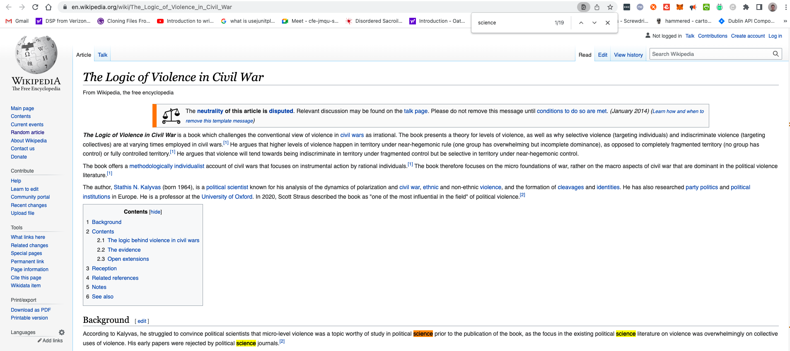

# Wikipedia Search Engine

This is a java application that downloads 200 random Wikipedia articles from the Wikipedia API. It then prompts the user to enter a search
query, searches the downloaded 200 articles for the search query and returns the list of wiki article URLs which contain this query,
ordered from most relevant to least relevant. Article relevance is determined by the number of times the search query appeared in the wiki article.
This is repeated until the user enters: "quit search engine"

This application uses a dependency for parsing html String data, so cannot be simply run as a single executable file using e.g. java -jar file.jar
It must be run as a gradle task. To run this application, please clone this repo to your local machine. Then, from the top level of the
project folder, run the following task to build the application: 
`./gradlew clean build`

Then to run the application, run:
`./gradlew run -q --console=plain` (-q and --console=plain arguments are added to remove all the "noise" output from gradle)

I also added a basic unit test to test the SearchEngine class - For the sake of time and convenience I have added two unit tests into a single test method as these tests are just added to show proof of concept.
Tests are run as part of the build task already run above, but to run tests independently, run:
`./gradlew test` (adding -i option before test will output more gradle task info)

The application can also be run from intellij IDEA very easily if you prefer.

The approach taken to solving this task was to find a relatively efficient solution that I could implement in about 3 hours. The solution 
implemented works as follows:
* When the app starts up it immediately downloads random articles from Wikipedia by making http requests to https://en.wikipedia.org/wiki/Special:Random
* It makes 200 of these requests, and parses each response before saving to local memory. Parsing was used to extract only the relevant text from the html file returned from the Wikipedia API, removing all html tags and returning a string of only relevant words associated with that article. Jsoup dependency was used to implement this parsing.
* After downloading all articles, it prompts user to enter search query, after which it iterates through articles and uses regex pattern matching to count occurrences of search query in the article. 
* It saves URLs of all articles with a 1 or more occurrences of search query, and displays this list of URLs to the user along with search query count, in descending order.
* This process repeats until user enters "quit search engine"

You can see screenshots below of how to app should work:

I tested its accuracy by opening the first article listed for "science" above (for example) in a browser and running "command + F" for "science":

You can see that the number of times the query is found matches correctly. 

Some additional notes:
* Implementing the functioning MVP took about 3 hours. Then I spent some additional time cleaning up the code and adding some basic unit tests.
* Ideally articles would be stored in persistent storage, not local memory, but felt that integrating a DB like MySQL was out of scope for an app that should take 3 hours to implement.
* It takes about 2 minutes to download the articles. Each time an article is received it is immediately parsed, so most of this time is actually spent parsing the data rather than requesting the data. 
* The accuracy of this app relies on the parsing of html data, and more specifically, deciding what test data returned is relevant. Wikipedia articles have a lot of links etc on the page so this is a difficult task. When testing the app I noticed that sometimes the search query count returned to the user for some article was one or two different to when I ran a basic find for the same search query in the article in my browser. Overall though it's quite accurate but if I had some more time I might spend it here.